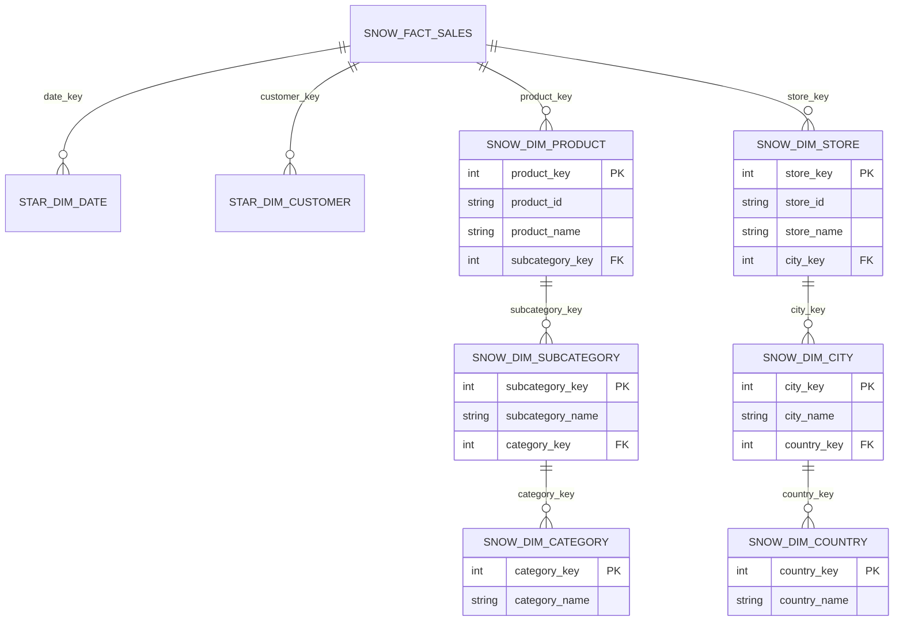

# Snowflake Schema ERD

```mermaid
erDiagram
    SNOW_FACT_SALES ||--o{ STAR_DIM_DATE : "date_key"
    SNOW_FACT_SALES ||--o{ STAR_DIM_CUSTOMER : "customer_key"
    SNOW_FACT_SALES ||--o{ SNOW_DIM_PRODUCT : "product_key"
    SNOW_FACT_SALES ||--o{ SNOW_DIM_STORE : "store_key"

    SNOW_DIM_PRODUCT ||--o{ SNOW_DIM_SUBCATEGORY : "subcategory_key"
    SNOW_DIM_SUBCATEGORY ||--o{ SNOW_DIM_CATEGORY : "category_key"

    SNOW_DIM_STORE ||--o{ SNOW_DIM_CITY : "city_key"
    SNOW_DIM_CITY ||--o{ SNOW_DIM_COUNTRY : "country_key"

    SNOW_DIM_CATEGORY {
        int category_key PK
        string category_name
    }
    SNOW_DIM_SUBCATEGORY {
        int subcategory_key PK
        string subcategory_name
        int category_key FK
    }
    SNOW_DIM_PRODUCT {
        int product_key PK
        string product_id
        string product_name
        int subcategory_key FK
    }
    SNOW_DIM_COUNTRY {
        int country_key PK
        string country_name
    }
    SNOW_DIM_CITY {
        int city_key PK
        string city_name
        int country_key FK
    }
    SNOW_DIM_STORE {
        int store_key PK
        string store_id
        string store_name
        int city_key FK
    }
```