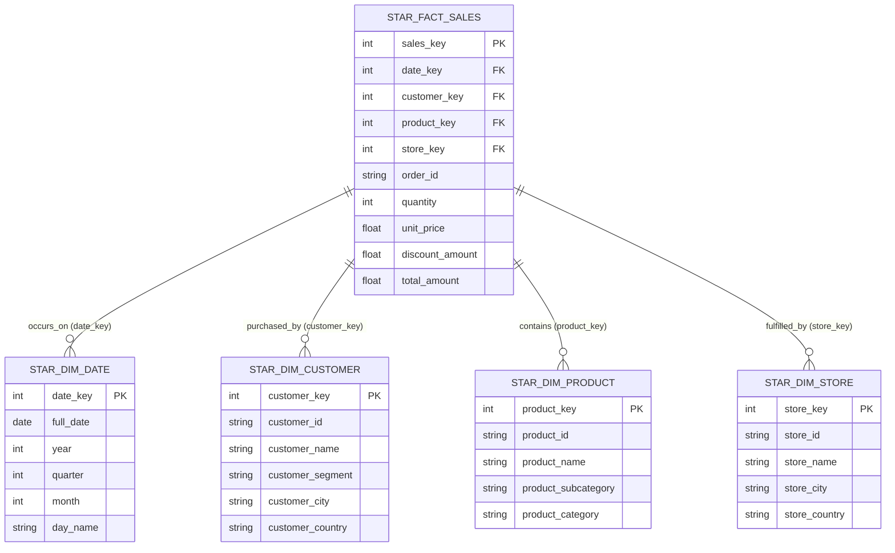

# Kimball Star Schema ERD

```mermaid
erDiagram
    STAR_FACT_SALES ||--o{ STAR_DIM_DATE : "occurs_on (date_key)"
    STAR_FACT_SALES ||--o{ STAR_DIM_CUSTOMER : "purchased_by (customer_key)"
    STAR_FACT_SALES ||--o{ STAR_DIM_PRODUCT : "contains (product_key)"
    STAR_FACT_SALES ||--o{ STAR_DIM_STORE : "fulfilled_by (store_key)"

    STAR_FACT_SALES {
        int sales_key PK
        int date_key FK
        int customer_key FK
        int product_key FK
        int store_key FK
        string order_id
        int quantity
        float unit_price
        float discount_amount
        float total_amount
    }

    STAR_DIM_DATE {
        int date_key PK
        date full_date
        int year
        int quarter
        int month
        string day_name
    }

    STAR_DIM_CUSTOMER {
        int customer_key PK
        string customer_id
        string customer_name
        string customer_segment
        string customer_city
        string customer_country
    }

    STAR_DIM_PRODUCT {
        int product_key PK
        string product_id
        string product_name
        string product_subcategory
        string product_category
    }

    STAR_DIM_STORE {
        int store_key PK
        string store_id
        string store_name
        string store_city
        string store_country
    }
```